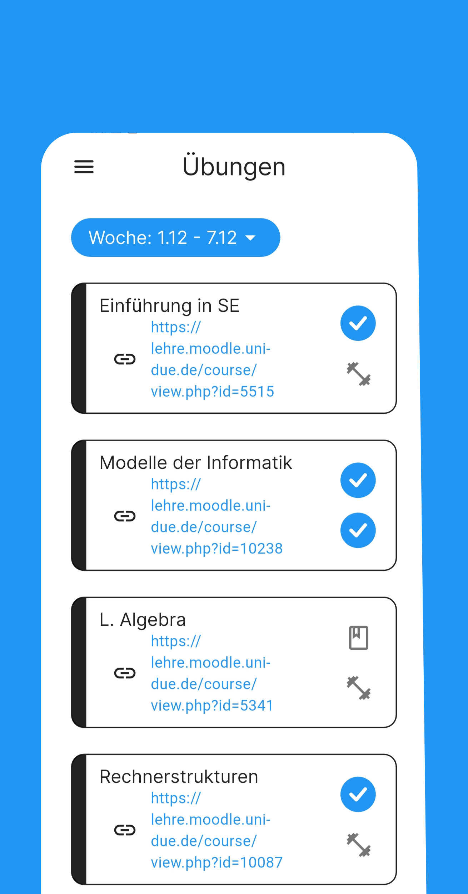
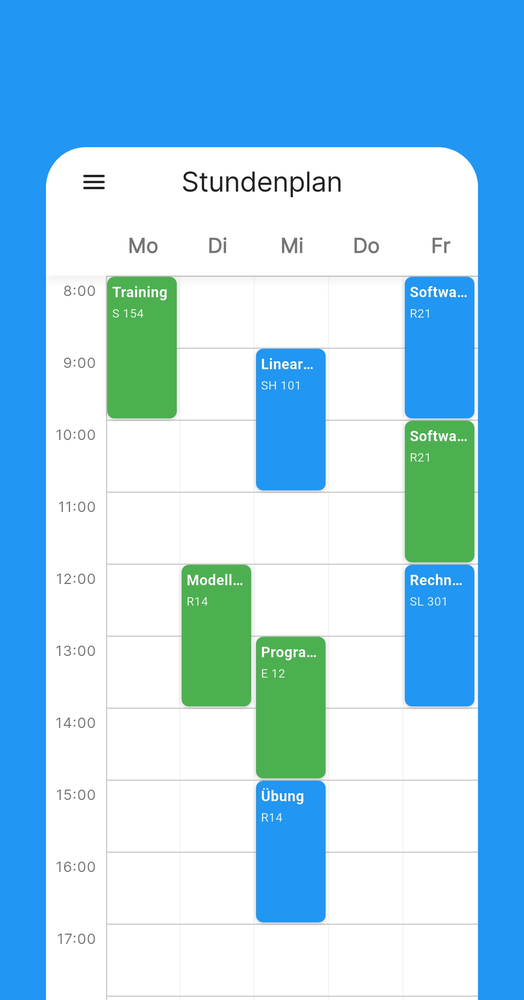
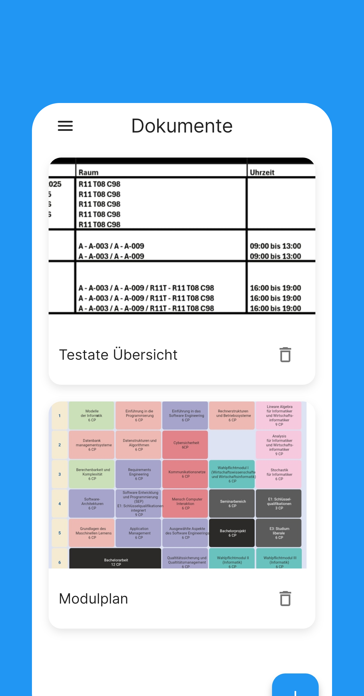

# 🎓 Uni Track

**The most stylish companion for your studies. Organize modules, schedules, and documents with ease.**

[](https://play.google.com/store/apps/details?id=YOUR_PACKAGE_NAME)
[]()
[](LICENSE)

> **About:** This project was born out of frustration with cluttered and outdated university apps. Uni Track connects powerful functionality with a modern, clean UI/UX design that you'll actually enjoy using.

---

## ✨ Features

Uni Track is more than just a calendar. It is the central hub for your entire student life.

* 🎨 **Design First:** A modern, clean interface focused on usability. No more "Windows 95" look & feel.
* 📚 **Module Management:** Organize your lectures, exercises, and modules in one structured view.
* 📂 **Document Storage:** Save scripts, homework, and notes directly linked to the specific module – stop searching through endless download folders.
* 📅 **Smart Calendar:** Keep track of deadlines, exams, and lecture times effortlessly.

---

## 📸 Screenshots

*Experience the design.*

| Module View | Calendar | Documents | Settings |
|:---:|:---:|:---:|:---:|
|  |  |  |  |


---

## 🛠 Tech Stack

This project is built using:

* **Framework:** Flutter
* **Database:** Hive 
* **Architecture:** Feature First

---

## 🚀 Installation & Setup

To run this project locally on your machine:

1.  **Clone the repository:**
    ```bash
    git clone [https://github.com/YOUR_USERNAME/uni-track.git](https://github.com/YOUR_USERNAME/uni-track.git)
    cd uni-track
    ```

2.  **Install dependencies:**
    ```bash
    # Example (adjust based on your framework):
    flutter pub get
    ```

3.  **Run the app:**
    ```bash
    flutter run
    ```

---

## 📲 Download & Testing

The app is currently in **Closed Beta** on the Google Play Store.

* **Beta Access:** The app is currently being tested by a closed group of students.
* **Request Access:** If you want to join the testing phase, please open an issue or contact me directly.

---

## 🤝 Contributing

Contributions are welcome! If you have ideas for new features or want to improve the code:

1.  Fork the Project
2.  Create your Feature Branch (`git checkout -b feature/AmazingFeature`)
3.  Commit your Changes (`git commit -m 'Add some AmazingFeature'`)
4.  Push to the Branch (`git push origin feature/AmazingFeature`)
5.  Open a Pull Request

---

## 📝 License

Distributed under the MIT License. See `LICENSE` for more information.

---

**Made by Lennart K.**
